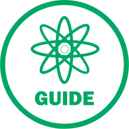

# Like
By [Stefan Hartmann](https://thenounproject.com/spirenzo), from the [Noun Project](https://thenounproject.com/term/like/201300/)

The project icon is pulled from 'TheNounProject', and adapted into the flat-circle icon approach.

The icon has been altered for the purposes of a project icon.

---
|||
|---|---|
|**Title**|Like|
|**Author**|[Stefan Hartmann](https://thenounproject.com/spirenzo)|
|**Source**|https://thenounproject.com/term/like/201300/|
|**License**|Public Domain|
|**Tags**|Like, Special, Share, Notice, Love, Heart, Friend, Favorite, Adore, Admire, Want To Be With|

---